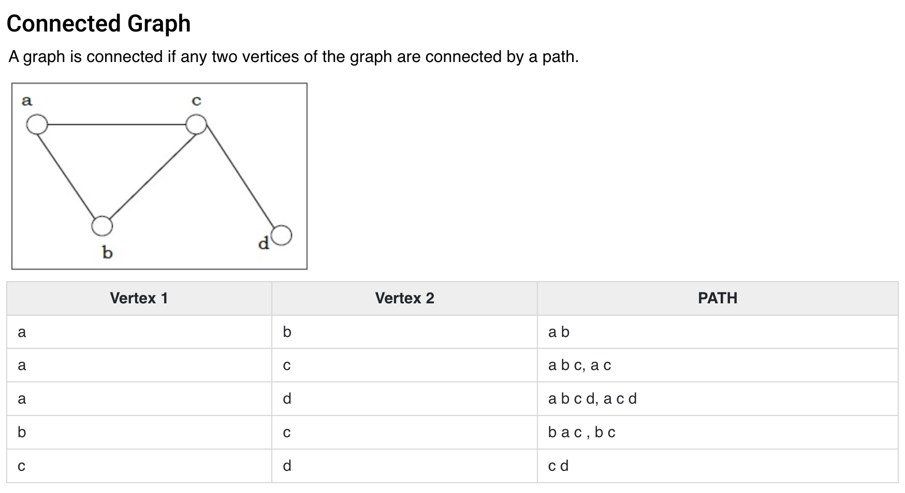
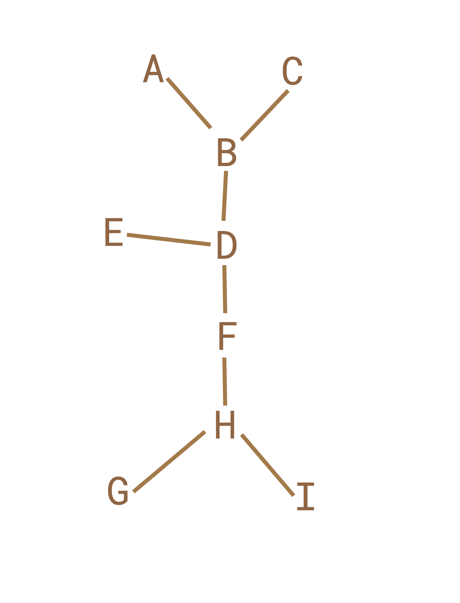
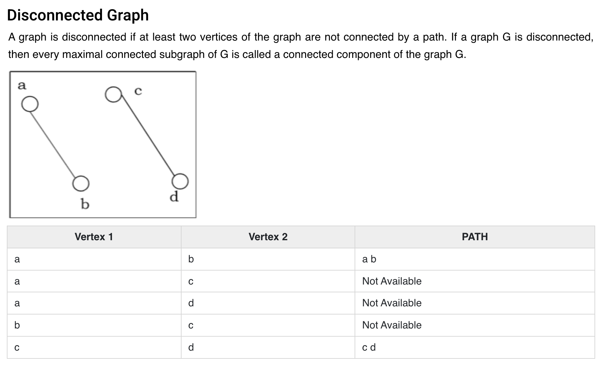
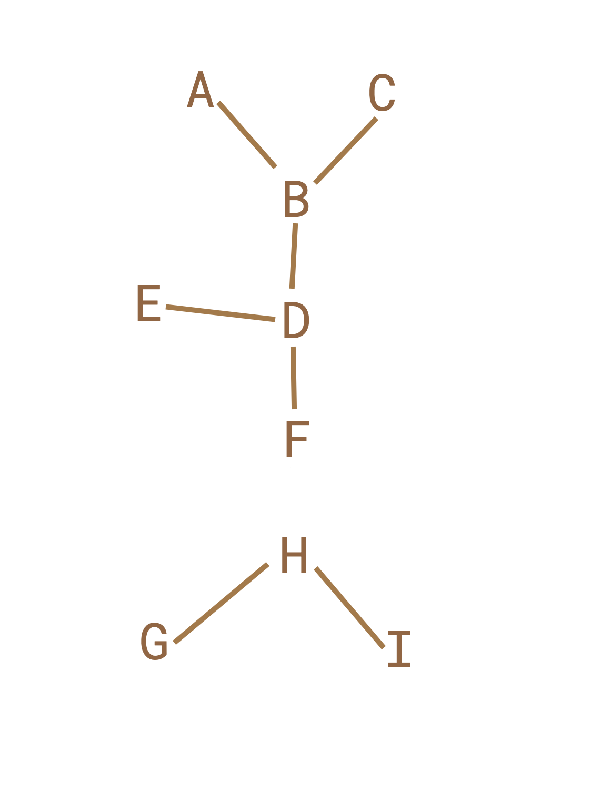

# Connected Graph and Disconnected Graph

## Connected Graph

### Explanation



### Samples

Here is a sample for a connected Graph :



Here is some of the input sample :
```
A-B-C,B-D-E,D-F-H,G-H-I

a-b-c,b-d-e,d-f-h,g-h-i

a-b,b-c,b-d,d-e,d-f,f-h,h-i,h-g
```

## Disconnected Graph

### Explanation



### Samples

Here is a sample for a disconnected Graph :



Here is some of the input sample :
```
A-B-C,B-D-E,D-F,G-H-I

a-b-c,b-d-e,d-f,g-h-i

a-b,b-c,b-d,d-e,d-f,h-i,h-g
```
